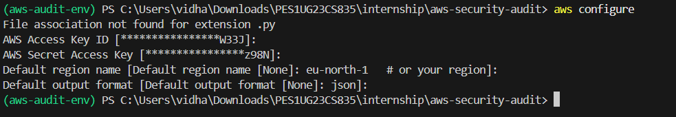
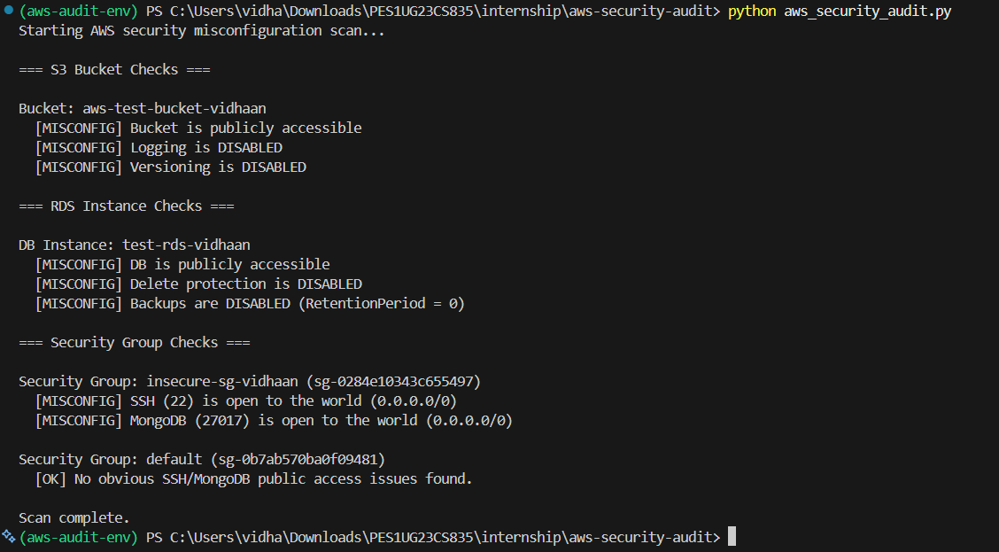
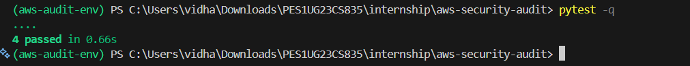

# 🛡️ AWS Security Misconfiguration Audit – Gauntlet Assignment

> **Author:** Vidhaan Viswas 

[](https://www.python.org/)


## 📌 Overview

This repository contains a **small, read-only Python tool** that scans an AWS account for common security misconfigurations in:

- **Amazon S3**
  - Publicly accessible buckets  
  - Buckets without logging  
  - Buckets without versioning  

- **Amazon RDS**
  - Publicly accessible DB instances  
  - Instances without deletion protection  
  - Instances without automated backups  

- **EC2 Security Groups**
  - SSH (`22`) open to the world  
  - MongoDB (`27017`) open to the world 

All checks are implemented using the **`boto3`** SDK and perform **only read operations**.

---

## 🧰 Tech Stack

- **Language:** Python 3.8+
- **AWS SDK:** `boto3`
- **Testing:** `pytest`
- **Environment:** Any system with Python & AWS credentials configured

---

## ✅ What the Tool Checks

| AWS Service     | Check                                      | Flagged as `[MISCONFIG]` when…                          |
|-----------------|--------------------------------------------|--------------------------------------------------------|
| **S3**          | Public access                              | Bucket is publicly accessible                          |
|                 | Logging                                    | Logging is **disabled**                                |
|                 | Versioning                                 | Versioning is **disabled**                             |
| **RDS**         | Public accessibility                       | Instance is publicly accessible                        |
|                 | Deletion protection                        | Deletion protection is **disabled**                    |
|                 | Automated backups                          | Backups are **disabled** or retention is too low       |
| **Security Groups** | SSH exposure (`22/tcp`)                | Rule allows `0.0.0.0/0` or `::/0`                       |
|                 | MongoDB exposure (`27017/tcp`)             | Rule allows `0.0.0.0/0` or `::/0`                       |

The script prints `[MISCONFIG]` for each of these checks.

---

## 🔑 Prerequisites

- **Python**: `3.8+`
- **AWS account** with **read-only credentials**
- AWS credentials configured via one of:
  - `aws configure`
  - Environment variables (`AWS_ACCESS_KEY_ID`, `AWS_SECRET_ACCESS_KEY`, optionally `AWS_DEFAULT_REGION`)
  - Any other standard AWS credential provider supported by `boto3`

## 🖼️ AWS CLI Configuration Screenshot

---

## Install

Windows PowerShell (recommended):

```powershell
# create and activate a virtual environment (Windows PowerShell)
python -m venv .venv
.\.venv\Scripts\Activate.ps1

# install dependencies
pip install -r requirements.txt
```

Or (platform-agnostic):

```bash
python -m venv .venv
source .venv/bin/activate
pip install -r requirements.txt
```

---

## Usage

By default the script sets `AWS_REGION` at the top of `aws_security_audit.py`. You can edit that value or rely on your environment/AWS configuration.

Run the audit:

```bash
python aws_security_audit.py
```
Expected output is printed to stdout and indicates `[MISCONFIG]` for each check.

## 🖼️ Audit Scan Output


---

## Running Tests

The project includes pytest-based tests that mock AWS clients. Run them with:

```bash
pytest -q
```
## 🖼️ Pytest Results


---

## Project Structure

```
aws_security_audit.py        # Main audit script
requirements.txt             # Dependencies (boto3, pytest)
README.md                    # This file
tests/                       # Unit tests (mock-based)
report/                      # Output Results (Screen-Shots)
```

---

## Notes

- The tool uses heuristic checks and is not a full security scanner.
- Credentials used should have read-only permissions.
- To use a different region, modify AWS_REGION or set AWS_DEFAULT_REGION in the environment.

---

<details>
<summary>⚖️ <strong>Security Disclaimer</strong></summary>

<br/>

<sub>
This repository and all associated materials are provided solely for academic and assessment purposes.  
All AWS interactions were conducted using controlled, read-only permissions to ensure zero modification or disruption of cloud resources.
<br>
Unauthorized use of this tool including security scanning, probing, or auditing of systems without explicit written authorization—may violate organizational policies, contractual obligations, and applicable laws.
<br>
The author assumes no responsibility for any misuse, unintended consequences, or unauthorized application of the contents herein.
</sub>

</details>

